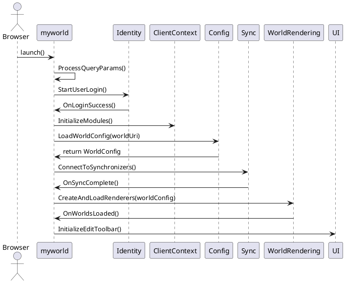
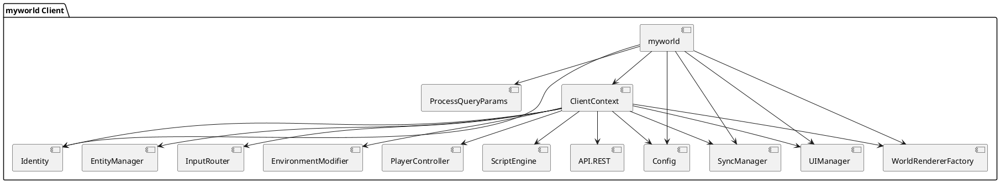
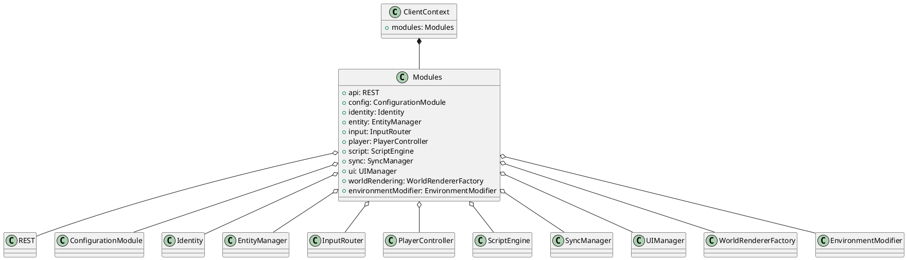
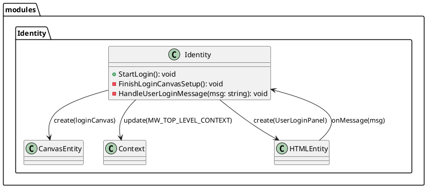
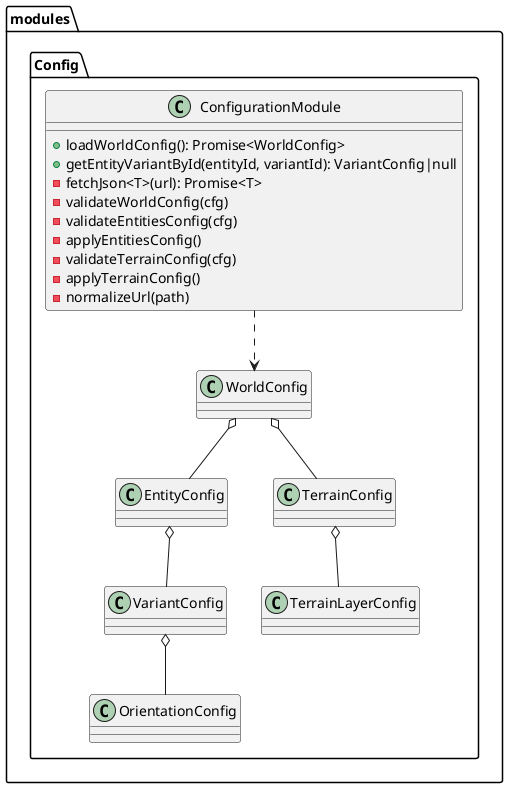
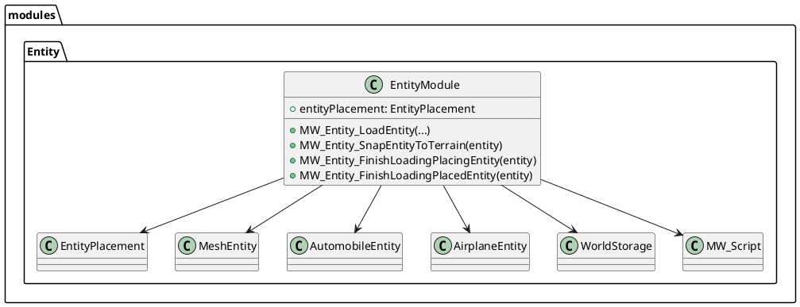
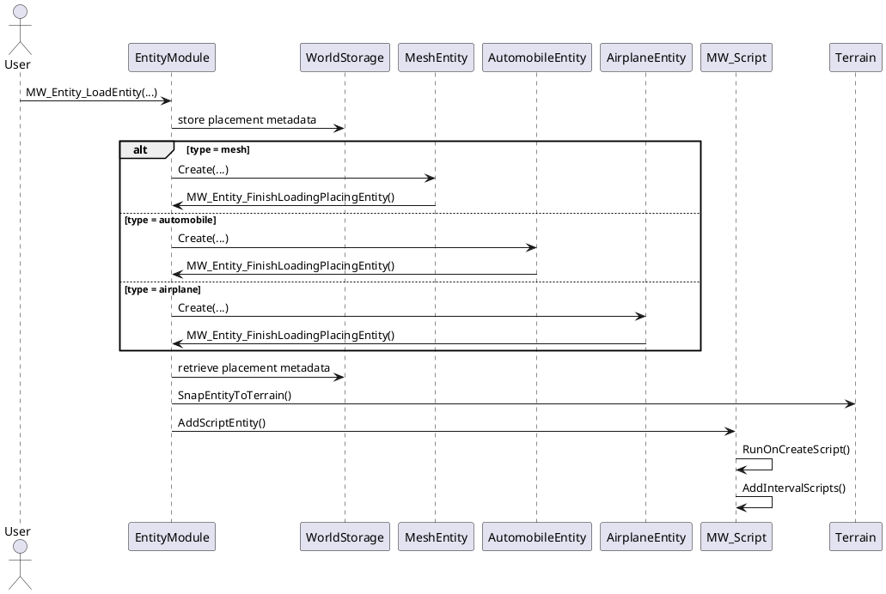
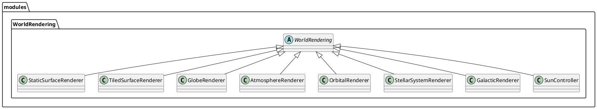
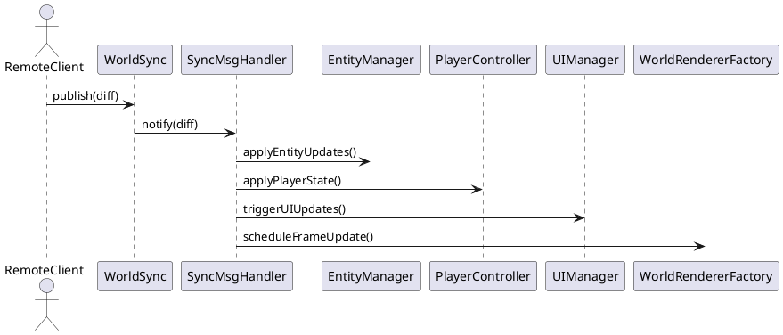
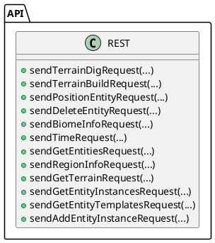

# 🌐 MyWorlds TypeScript Client Architecture

This document provides a full architectural overview of the MyWorlds TypeScript client. It combines structured Markdown with PlantUML diagrams to guide implementation by developers and AI agents. The client is modular, extensible, and designed for spatial interaction, entity placement, world rendering, and real-time synchronization.

---

## 📦 Entrypoint: `myworld` Script

The `myworld` script orchestrates the client startup sequence:

1. Parse query parameters  
2. Trigger login via Identity module  
3. Initialize all core modules into `ClientContext`  
4. Load world configuration  
5. Connect to synchronization sessions  
6. Instantiate and load world renderers  
7. Activate UI editing tools  

### 🧭 Initialization Sequence

---

## 🧩 Component Dependencies

---

## 🧠 ClientContext & Core Modules

---

## 🔐 Identity Module

Handles login via canvas and HTML overlay.

---

## 🌍 Configuration Module

Loads and applies world, entity, and terrain configuration.

---

## 🧱 Entity Module

Manages entity creation, placement, and terrain alignment.

### Entity Loading Flow

---

## 🌐 World Rendering Subsystem

Supports multiple renderers for different spatial scales.

---

## 🔁 Synchronization Flow

Handles real-time updates across clients.

---

## 🌐 REST API Component

Provides HTTP endpoints for terrain, entities, and metadata.

